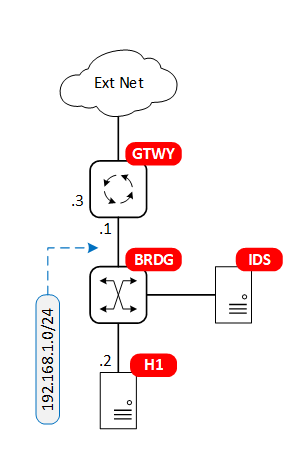

# Snort lab

This lab demonstrates the use of the intrusion detection/prevention system (IDS/IPS) [Snort](https://snort.org/) in monitoring traffic between a host and a router gateway to an external network.





## Requirements

To use this lab, you need to install [containerlab](https://containerlab.srlinux.dev/) (I used the [script method](https://containerlab.srlinux.dev/install/#install-script) Ubuntu 20.04 VM). You also need to have basic familiarity with [Docker](https://www.docker.com/).


## Topology

The labs is created using containerlab. It consists of three docker containers: a host, an FRR router, and a SNORT container. The three containers are connected via Linux bridge.

The bridge is configured as a hub (i.e. all inbound frames are broadcast to all ports) to ensure that all packets exchanged between the host and router are received by Snort. Normally the use of a hub in a network has negative performance and security implications, but since this hub has only three interfaces, the lab configuration is easier than port mirroring.

The gateway connects the internal LAN (represented by the bridge) to an external network. The external network here is the management network that containerlab creates by default to connect all containers. The default gateway on the host points to the gateway to ensure that all non-management traffic flows through the gateway.

The Snort container can be configured with custom configuration and rules files.

## Starting and ending the lab

To start the lab, you must create a Linux bridge manually before starting containerlab:

```
$ ./setup-bridge.sh
$ sudo clab deploy --topo ids-snort.clab.yml
```

To end the lab:

```
$ sudo clab destroy --topo ids-snort.clab.yml
```

To remove the bridge:

```
$ sudo ip link del brdg
```

## Simple usage Scenario

To get you started, try the following after starting the lab:

Start snort. Snort options directs alerts to the console. The custom rules included in this repository alerts about icmp traffic and tcp traffic to port 80 (http).

```
$ docker exec -it clab-ids-snort-ids snort -i eth1 -c /etc/snort/snort.conf -A console
```

On a different terminal, start ping from the host:

```
$ docker exec -it clab-ids-snort-h1 ping 8.8.8
```

also try:

```
$ docker exec -it clab-ids-snort-h1 curl http://adhocnode.com
```

Snort output should be something like the following:

```
04/23-01:51:58.351369  [**] [1:1000004:0] Pinging... [**] [Priority: 0] {ICMP} 8.8.8.8 -> 192.168.1.2
04/23-01:51:59.357024  [**] [1:1000004:0] Pinging... [**] [Priority: 0] {ICMP} 192.168.1.2 -> 8.8.8.8
...
04/23-01:52:39.743436  [**] [1:1000003:0] Port 80 is accessing [**] [Priority: 0] {TCP} 192.168.1.2:40226 -> 23.229.155.72:80
04/23-01:52:39.748684  [**] [1:1000003:0] Port 80 is accessing [**] [Priority: 0] {TCP} 192.168.1.2:40226 -> 23.229.155.72:80
...
```
